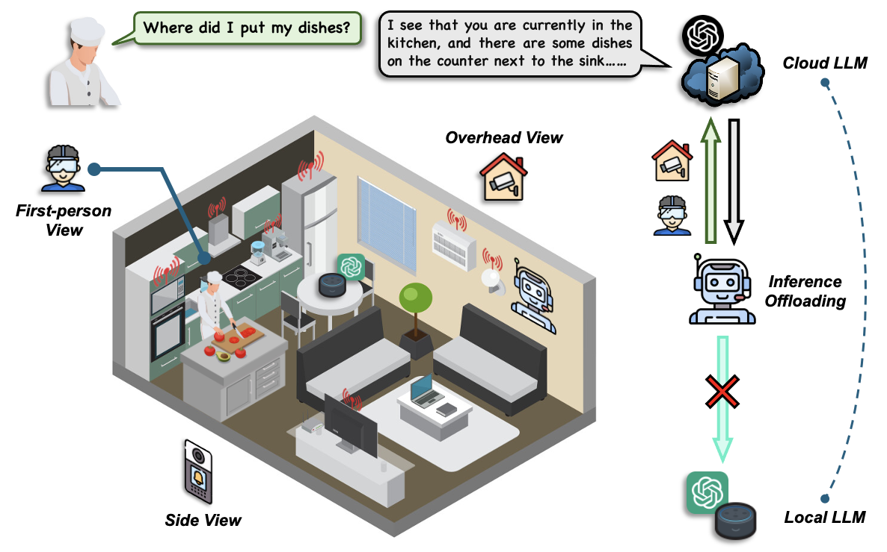
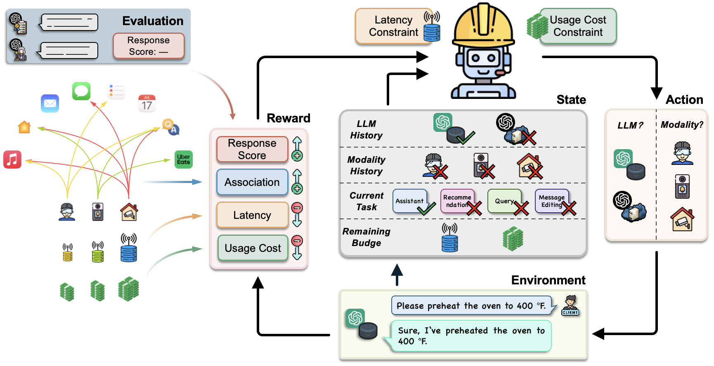
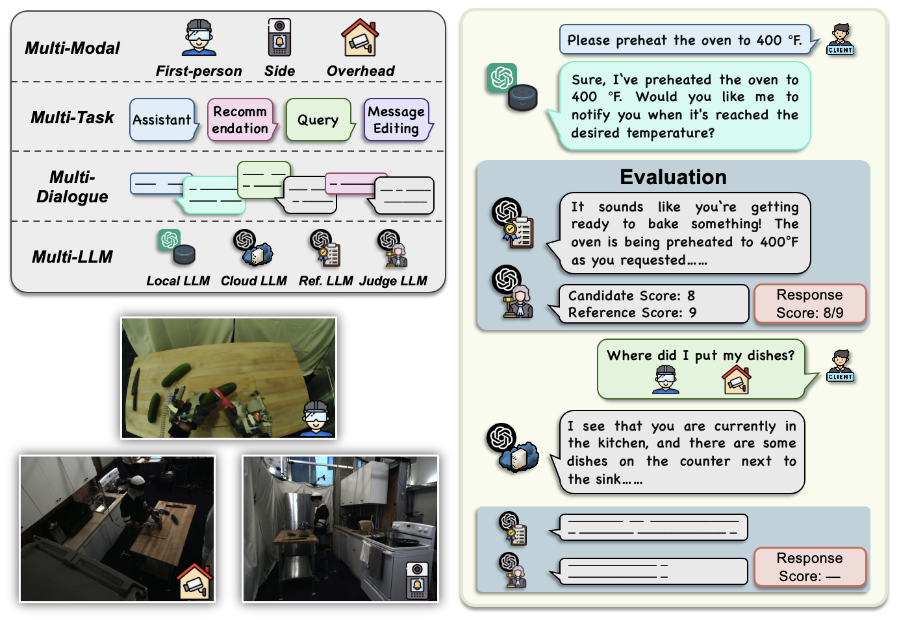

## Device-Cloud Collaborative LLM Inference with Multi-Modal, Multi-Task, Multi-Turn Conversations

[](https://www.python.org/downloads/release/python-31012/)
[](https://opensource.org/licenses/MIT) 

[](https://arxiv.org/abs/2502.11007)

[](#)

## 👨‍🍳 Use Case: Kitchen Activity Assistance with LLM

Imagine a scenario where an intelligent assistant helps you track activities in your kitchen:

- **User:** *Where did I put my dishes?*
- **RL Agent:** Processes first-person and overhead camera views -> Sends to Cloud LLM.
- **Cloud LLM:** *I see that you are in the kitchen. There are dishes on the counter next to the sink, likely just placed there after washing. Would you like me to turn on the dishwasher so you can put them away?*

<div align="center">
    
</div>


## 🔥 Our Framework

We present **TMO** (Three-M Offloading), a device-cloud LLM inference system designed to optimize **response quality**, **latency**, and **cost efficiency** for LLMs in **multi-modal, multi-task, and multi-turn conversations**. TMO dynamically adapts to diverse conversational demands across tasks such as assistance, query, recommendation, and message editing. To enhance performance, we propose resource-constrained RL, which selects the best LLMs and modalities for inference, balancing quality, latency, and cost. RCRL also integrates user prompt associations with multi-modal data to effectively manage task connections in decision-making. The journal extension further introduces a resource-aware adaptation mechanism that generalizes to arbitrary user-specified resource budgets unseen during training.

<div align="center">
    
</div>


## 🖥️ Prerequisites

Install the package (and its dependencies) in editable mode:
```bash
pip install -e .
```

Or, if you only want the runtime dependencies:
```bash
pip install -r requirements.txt
```


## 📚 M4A1 Dataset

We introduce **M4A1**, a comprehensive dataset capturing the **four multi-** elements **all in one** dataset:
1. **Multi-Modal:** Includes three different view images.
2. **Multi-Task:** Features four distinct tasks.
3. **Multi-Turn:** Contains sequences of 2–5 conversational turns.
4. **Multi-LLM:** Incorporates four LLMs tailored for different purposes.

<div align="center">
    
</div>


## 🗂️ Folder Structure
```
TMO/
│   README.md
│   requirements.txt
│   pyproject.toml
│   LICENSE
│
├─── tmo/                            # importable Python package
│   │   __init__.py
│   │   env.py                       # M4A1_Env
│   │   data.py                      # preprocess_data / create_long_samples / split_dataset
│   │   devices.py                   # LOCAL_DEVICES / CLOUD_SERVERS profiles
│   │   evaluator.py                 # evaluate
│   │   trainer.py                   # process_model / should_process_model
│   │   parallel.py                  # run_one / run_parallel
│   │   config.py                    # args_parser
│
├─── scripts/
│   │   run_main_experiment.py       # entry-point that reproduces the paper's main table
│
├─── custom/                         # template for porting TMO beyond M4A1
│   │   README.md
│   │   run_custom.py                # synthetic scaling sweep across (modalities, tasks, turns)
│
├─── dataset/
│   │   M4A1.json
│
└─── figures/
```

- **`tmo/`** -- importable library code. The split is by responsibility: the
  Gymnasium env (`env.py`), data preprocessing (`data.py`), hardware / cloud
  profiles (`devices.py`), single-experiment training/evaluation
  (`trainer.py`, `evaluator.py`), parallel sweeping (`parallel.py`), and CLI
  configuration (`config.py`). Resource constraints are enforced inside
  `env.py` by (i) augmenting the observation with the remaining latency/usage
  budget when `Resource_Constraint=True` and (ii) zero-rewarding any
  over-budget step, which removes the need for the legacy
  `RC_PPO`/`RC_A2C`/`RC_DQN` policy classes.
- **`scripts/run_main_experiment.py`** -- the script that reproduces the
  paper's main results table and serves as the canonical usage example for
  the API. All reusable logic lives in `tmo/`; the script only handles
  argument parsing, the (seed × model × constraint) grid construction, and
  dispatching the grid through `tmo.run_parallel`.
- **`custom/`** -- a runnable template for porting TMO beyond M4A1. Sweeps
  several `(num_modalities, num_tasks, num_turns)` configurations on a fully
  synthetic dataset and acts as a drop-in starting point for new datasets,
  hardware profiles, and cloud endpoints. See [`custom/README.md`](custom/README.md).
- **`dataset/`** -- the M4A1 dataset.


## 🏃‍♂ Run Code

Reproduce the main results table:
```bash
python scripts/run_main_experiment.py --repeat 3
```


## 🧩 Adapting TMO to a New Scenario

A runnable end-to-end template that ports TMO beyond M4A1 — different number of modalities, tasks, dialogue lengths, local hardware, or cloud endpoint — lives in [`custom/`](custom/README.md). It runs on a fully synthetic dataset (so it does not depend on M4A1), sweeps seven scaling configurations, and reports response, latency, usage, reward, and per-budget violation for `Local` / `Cloud` / `Random` baselines against the `(RC-)A2C` policy. See [`custom/README.md`](custom/README.md) for the value semantics and a copy-paste starting point.


## 📄 Citation

If you find our work useful, please consider citing:
```bibtex
@article{yuan2026devicecloud,
  title={Device-Cloud Collaborative LLM Inference with Multi-Modal, Multi-Task, Multi-Turn Conversations},
  author={Yuan, Liangqi and Han, Dong-Jun and Wang, Shiqiang and Brinton, Christopher},
  journal={IEEE/ACM Transactions on Networking},
  year={2026}
}
```

```bibtex
@inproceedings{yuan2025local,
  title={Local-Cloud Inference Offloading for LLMs in Multi-Modal, Multi-Task, Multi-Dialogue Settings},
  author={Yuan, Liangqi and Han, Dong-Jun and Wang, Shiqiang and Brinton, Christopher},
  booktitle={Proceedings of the Twenty-Sixth International Symposium on Theory, Algorithmic Foundations, and Protocol Design for Mobile Networks and Mobile Computing},
  pages={201--210},
  year={2025}
}
```
